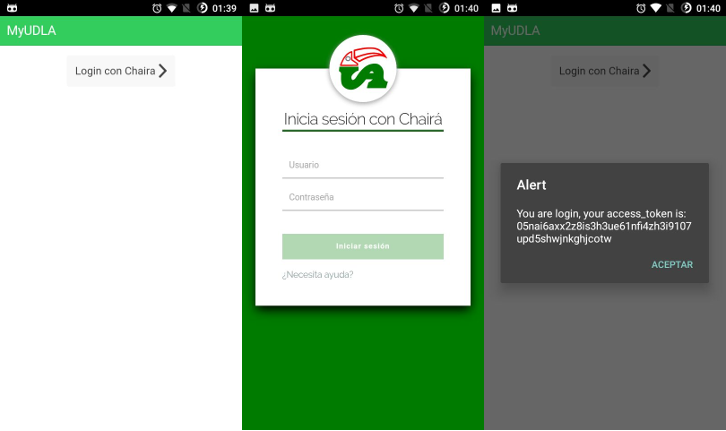

MyUDLA Proyecto base en IONIC
==============================

Proyecto base en Ionic para demostrar el uso de la librería  [ng-chaira-oauth](https://github.com/FlorenciaJS/ng-chaira-oauth/)

## Como ejecutar este proyecto:

Clonar repositorio:

```bash
$ git clone https://github.com/florenciajs/myudla.git
```

Instalar dependencias npm

```bash
$ npm install
```
o
```bash
$ yarn
```

Agregar plataforma Ionic (android)

```bash
$ ionic platform add android
```

Instalar plugins cordova:
```bash
$ ionic state restore --plugins
```

Instalar librerías de Bower:

```bash
$ bower install
```

Ejecutar en dispositivo fisico o emulador (android):

```bash
$ ionic run android
```

## Capturas de pantalla:


